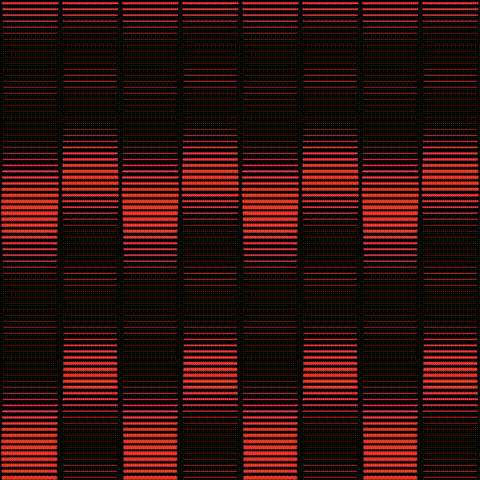

<h1 align="center">Grid</h1>

  

  A generative grid pattern that emphasizes on the use of nested for loops.  
  Draws rows of squares across the canvas with stroke thickness that pulses using a sine wave, while the background hue cycles continuously, creating a rippling, color-shifting grid animation.  
  Art made with code (Processing)

