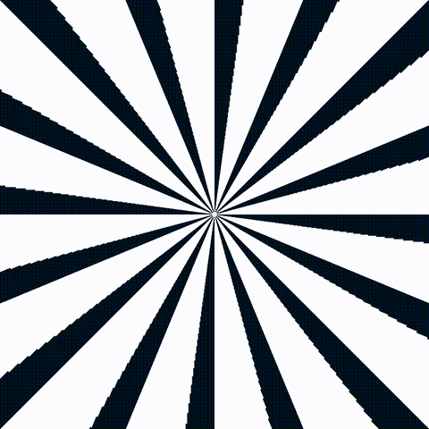

<h1 align="center">Illusion</h1>

  

  A generative spiral pattern that emphasizes on the use of nested for loops.  
  Draws rotated squares spiraling inward and outward around the canvas at 16 angles, with the rotation slowly shifting over time to create a continuous, hypnotic illusion effect.  
  Art made with code (Processing)

