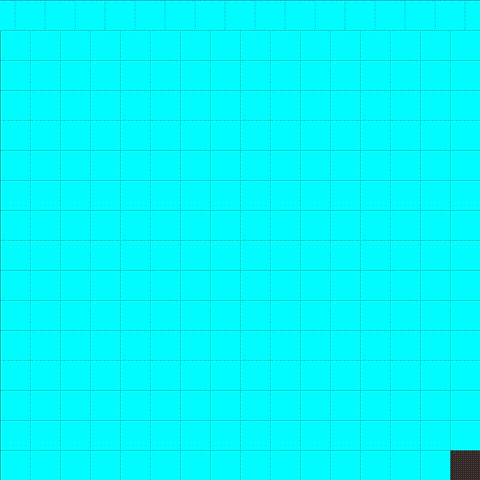

<h1 align="center">Minecraft</h1>

  

  A generative grid pattern that emphasizes on the use of a while loop.  
  Draws a grid of short vertical lines across the canvas, with each line's color shifting over time using sine and cosine — creating a slow, continuous color-cycling animation.  
  Made with code (Processing)

