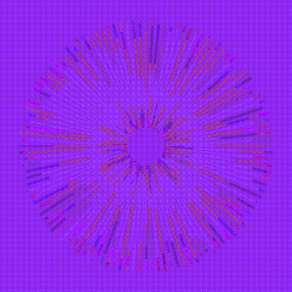

<h1 align="center">Sunburst</h1>

  

  A generative sunburst pattern that emphasizes on the use of the for loop.  
  Uses rotation and randomness to draw 30 layered bursts of lines outward from the center, each in a random purple-toned color.  
  Art made with code (Processing)

